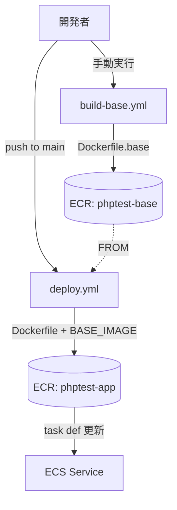
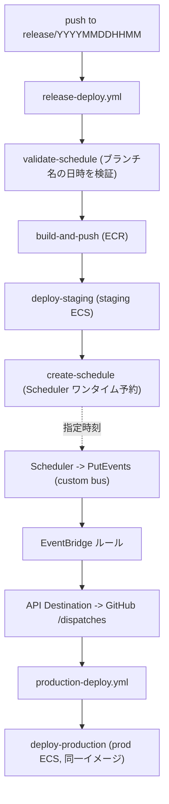

# PHP + Apache サンプルアプリ

`php:8.2-apache` と MySQL を Docker Compose で動かす、フレームワークなし（素のPHP）のウェブアプリです。

## ディレクトリ構成

```text
phptest/
├── docker-compose.yml          # web(php-apache) と db(mysql) の2サービス
├── docker/
│   ├── php/
│   │   ├── Dockerfile.base      # ベースイメージ（PHP拡張/Apache設定 + src を焼き込み）
│   │   ├── Dockerfile          # アプリイメージ（ベースをFROMして public をCOPY）
│   │   └── php.ini             # PHP設定（タイムゾーン/エラー表示など）
│   └── apache/
│       └── 000-default.conf    # DocumentRoot を public/ に変更
├── public/                     # 公開ディレクトリ（DocumentRoot）
│   ├── index.php               # エントリポイント
│   ├── assets/                 # css/js/画像
│   └── .htaccess               # ルーティング/書き換え
├── src/                        # 非公開のアプリコード
│   ├── Config/database.php     # DB接続(PDO)設定
│   ├── Controllers/            # 画面/処理ごとのロジック
│   └── Views/                  # テンプレート(HTML部分)
├── db/
│   └── init/01_schema.sql      # 初回起動時に流す初期スキーマ
├── .env.example                # DB認証情報などのサンプル
├── .gitignore
└── README.md
```

## 起動方法

1. 環境変数ファイルを用意します。

```bash
cp .env.example .env
```

2. ベースイメージをビルドします（初回、または PHP拡張/設定/`src` を変更したときだけ）。

```bash
docker build -f docker/php/Dockerfile.base -t phptest-base:latest .
```

3. コンテナをビルドして起動します。

```bash
docker compose up -d --build
```

4. ブラウザで以下にアクセスします。

```text
http://localhost:8080
```

DBに接続できていれば、MySQLから取得した初期メッセージが表示されます。

## ビルド構成（2段イメージ）

変更の多い `public/` の更新を高速化するため、イメージを2段に分割しています。

- ベースイメージ（`docker/php/Dockerfile.base`）: PHP拡張・Apache設定・`php.ini`・`src/` を焼き込んだ、変化の少ない基盤。
- アプリイメージ（`docker/php/Dockerfile`）: ベースイメージを `FROM` して `public/` をCOPYするだけ。

### ベースイメージのビルド（初回 / 基盤や `src` を変えたときだけ）

```bash
docker build -f docker/php/Dockerfile.base -t phptest-base:latest .
```

### `public/` 変更時（高速。COPYレイヤーのみ再ビルド）

```bash
docker compose build web && docker compose up -d
```

> `BASE_IMAGE` のタグは `docker-compose.yml` の `web.build.args` で指定しています（既定: `phptest-base:latest`）。

## 停止 / クリーンアップ

```bash
# 停止
docker compose down

# DBのデータごと削除（初期スキーマを再投入したいとき）
docker compose down -v
```

## ポイント

- Apache の DocumentRoot を `public/` に設定し、`src/` や設定ファイルは Web から直接アクセスできないようにしています。
- DB接続情報は `.env`（Compose の environment 経由）で渡し、`src/Config/database.php` の PDO 接続で参照します。Compose 内ではDBホスト名はサービス名 `db` です。
- `db/init/*.sql` は MySQL コンテナ初回起動時に自動実行されます（データボリュームが空のときのみ）。

## CI/CD（GitHub Actions で ECR/ECS デプロイ）

ローカルの2段イメージ構成をそのまま CI に対応させ、複数のワークフローで運用します。

- `.github/workflows/build-base.yml`: **手動実行のみ**（`workflow_dispatch`）。`docker/php/Dockerfile.base` をビルドして ECR の `phptest-base` に push します。PHP拡張・Apache設定・`src/` など基盤を変えたときに実行します。
- `.github/workflows/deploy.yml`: `main` への **push 時**に実行。ECR の `phptest-base:latest` を `FROM` して `docker/php/Dockerfile`（`public/` のみ COPY）をビルドし、`phptest-app` に push 後、ECS サービスへデプロイします。デプロイは不変性のため `${GITHUB_SHA}` タグ基準で行います。



### リリースフロー（ステージング → 予約 → 本番）

`release/<YYYYMMDDHHMM>` ブランチへの push を起点に、ステージング検証 → **ブランチ名で指定した日時**に本番反映（同一イメージ）を自動化します。

ブランチ命名規約: `release/<YYYYMMDDHHMM>`（**JST / Asia/Tokyo** として解釈）。
例: `release/202607010200` → 2026-07-01 02:00 JST に本番反映。

- `.github/workflows/release-deploy.yml`: `release/**` への **push 時**に実行。4ジョブ構成です。
  1. `validate-schedule`: ブランチ名から本番反映日時を抽出・検証（12桁数字・実在日時・未来であること）。不正なら**ここで失敗**し、ビルド/デプロイへ進みません。
  2. `build-and-push`: アプリイメージをビルドして `phptest-app:${GITHUB_SHA}` を ECR へ push。
  3. `deploy-staging`: ステージング ECS サービス（`ECS_STAGING_SERVICE`）へデプロイ。
  4. `create-schedule`: **EventBridge Scheduler のワンタイム予約**を、ブランチ名の日時（`at(...)` + `Asia/Tokyo`）で作成。予約は実行後に自動削除（`ActionAfterCompletion=DELETE`）。
- `.github/workflows/production-deploy.yml`: **`repository_dispatch`（`production-deploy`）で起動する独立ワークフロー**。`client_payload.image_tag` のフルイメージ URI を本番 ECS サービス（`ECS_PROD_SERVICE`）へデプロイします。

EventBridge Scheduler は API Destination を直接呼べないため、`Scheduler → PutEvents（custom bus）→ EventBridge ルール → API Destination（GitHub `/dispatches`）` の連鎖で `repository_dispatch` を発火させます（静的部分は Terraform、ワンタイム予約のみ `release-deploy.yml` が作成）。



> 重要:
> - `production-deploy.yml` は **デフォルトブランチ（`main`）に存在**させてください（`repository_dispatch` はデフォルトブランチ上のワークフローしか起動しません）。
> - 本番ワークフローの run は `github.sha` が `main` の HEAD になるため、デプロイ対象は **`client_payload.image_tag` のみ**を使います。
> - 本番反映の日時は **ブランチ名 `release/<YYYYMMDDHHMM>`（JST）** で指定します。形式不正・実在しない日時・過去日時の場合は `validate-schedule` ジョブで失敗し、予約は作成されません。

### 事前準備（AWS 側）

ワークフローが必要とする AWS リソースは `terraform/` で管理します（後述の「インフラ構築（Terraform）」を参照）。`terraform apply` で以下が作成されます。

- IAM の OIDC プロバイダ（`token.actions.githubusercontent.com`）。
- このリポジトリ（`tsuchiya12345-wq/phptest`）を信頼する IAM ロール（ECR push / ECS 更新権限付き）。
- ECR リポジトリ 2つ（`phptest-base`, `phptest-app`）。
- ECS クラスター / サービス / タスク定義、ALB、タスク実行ロール、CloudWatch Logs グループ。

### GitHub に設定する Variables / Secrets

**Repository variables**（Settings → Secrets and variables → Actions → Variables）

| 名前 | 例 | 用途 |
| --- | --- | --- |
| `AWS_REGION` | `ap-northeast-1` | リージョン |
| `ECR_BASE_REPO` | `phptest-base` | ベースイメージの ECR リポジトリ名 |
| `ECR_APP_REPO` | `phptest-app` | アプリイメージの ECR リポジトリ名 |
| `ECS_CLUSTER` | `phptest-cluster` | ECS クラスター名（ステージング/本番共通） |
| `ECS_SERVICE` | `phptest-service` | ECS サービス名（既存 `deploy.yml` 用） |
| `ECS_STAGING_SERVICE` | `phptest-service` | ステージング ECS サービス名（`release-deploy.yml` 用） |
| `ECS_PROD_SERVICE` | `phptest-prod-service` | 本番 ECS サービス名（`production-deploy.yml` 用） |
| `ECS_TASK_FAMILY` | `phptest-task` | タスク定義ファミリー名 |
| `CONTAINER_NAME` | `phptest-web` | タスク定義内のコンテナ名 |
| `SCHEDULER_ROLE_ARN` | `arn:aws:iam::...:role/phptest-scheduler-role` | Scheduler が PutEvents する実行ロール ARN |
| `EVENT_BUS_ARN` | `arn:aws:events:...:event-bus/phptest-deploy-bus` | 予約イベントを送る custom bus の ARN |
| `EVENT_SOURCE` | `phptest.deploy` | 予約イベントの source |
| `EVENT_DETAIL_TYPE` | `production-deploy` | 予約イベントの detail-type |

> `release-deploy.yml` / `production-deploy.yml` 用の値は `terraform output github_variables` で一括出力されます。

**Repository secrets**

| 名前 | 用途 |
| --- | --- |
| `AWS_ROLE_ARN` | OIDC で引き受ける IAM ロールの ARN |
| `AWS_ACCOUNT_ID` | AWS アカウントID（必要に応じて利用） |

> 本番デプロイのトリガーに使う GitHub トークンは、GitHub 側ではなく **EventBridge Connection** に保管します（Terraform 変数 `github_dispatch_token` 経由で投入）。`repo`（または fine-grained で対象リポジトリの contents 書き込み）権限が必要です。

### タスク定義テンプレート

`.aws/task-definition.json` をデプロイ時のひな形として利用します。`<AWS_ACCOUNT_ID>` / `<AWS_REGION>` のプレースホルダは実値に合わせて編集してください（実行ロール ARN は `arn:aws:iam::<AWS_ACCOUNT_ID>:role/phptest-ecs-execution-role`、`awslogs-region` は `<AWS_REGION>`）。`image` は CI が `${GITHUB_SHA}` タグへ自動で差し替えます。

## インフラ構築（Terraform）

AWS 側のリソースは `terraform/` ディレクトリで管理します。構成は「デフォルト VPC を利用、ALB で公開、DB は対象外、state はローカル」です。

### 作成されるリソース

- ECR リポジトリ: `phptest-base` / `phptest-app`
- GitHub OIDC プロバイダ ＋ デプロイ用 IAM ロール（`phptest-gha-deploy-role`）
- ECS タスク実行ロール（`phptest-ecs-execution-role`）
- ECS クラスター / サービス / 初期タスク定義（Fargate）。ステージング（`phptest-service`）と本番（`phptest-prod-service`）の2サービス
- ALB・ターゲットグループ・リスナー（ステージング :80 / 本番 :8080）・セキュリティグループ
- CloudWatch Logs グループ（`/ecs/phptest-task` / `/ecs/phptest-prod-task`）
- EventBridge: custom bus（`phptest-deploy-bus`）・Connection・API Destination・ルール、および Scheduler 実行ロール / ルール起動ロール

> ECS サービスは `lifecycle { ignore_changes = [task_definition, desired_count] }` を設定しているため、初回は仮イメージ（`bootstrap_image`）で起動し、以後の継続デプロイは GitHub Actions（`.aws/task-definition.json`）が担います。Terraform と CI が衝突しません。

### 手順

```bash
cd terraform
terraform init
terraform plan
terraform apply
```

> `github_dispatch_token`（sensitive・既定値なし）は必須変数です。`TF_VAR_github_dispatch_token=<token>` などで投入してください（EventBridge Connection に保管され、本番デプロイの `repository_dispatch` 発火に使われます）。

### apply 後にやること

1. `terraform output` の値を GitHub に設定します。

```bash
terraform output github_variables      # Repository variables へ
terraform output github_actions_role_arn  # Secret: AWS_ROLE_ARN へ
terraform output aws_account_id            # Secret: AWS_ACCOUNT_ID へ
```

2. `.aws/task-definition.json` の `<AWS_ACCOUNT_ID>` / `<AWS_REGION>` を実値へ置換します。
3. GitHub Actions の `build-base.yml`（手動）→ `deploy.yml`（main push）の順で実行すると、ALB の DNS 名（`terraform output alb_dns_name`）でアプリにアクセスできます。

### 注意

- `terraform.tfstate` などの state ファイルと `.terraform/` は `.gitignore` 済みです（機密を含むためコミットしないでください）。
- OIDC プロバイダはアカウントに未作成である前提で新規作成します。既に他用途で作成済みの場合は `aws_iam_openid_connect_provider.github` を data 参照に変更してください。
